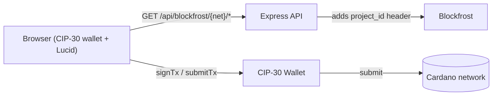

## Root cause

The current builder reads only the lovelace component of each UTxO and outputs only lovelace, so any UTxO carrying native assets (here, WorldMobileToken) breaks value conservation:

```39:51:js/lib/cardano-tx.js
function lovelaceFromTxOutput(output) {
  ...
  if (Array.isArray(amount) && amount.length > 0) {
    return BigInt(amount[0]);   // <-- drops the multi-asset bundle
  }
  ...
}
```

Lucid does proper coin selection, multi-asset change, fee estimation, and min-UTxO calculation, so we will offload all of that to it. We initially tried `@lucid-evolution/*`, but browser CDN delivery failed because of WASM MIME and bundling issues; the implementation now uses pinned `lucid-cardano@0.10.7` instead.

## Architecture



Lucid is loaded via `https://cdn.jsdelivr.net/npm/lucid-cardano@0.10.7/esm/mod.js` so the static frontend keeps its zero-build deployment (`render.yaml` `staticPublishPath: .`, `buildCommand: echo "No build step required"`). The raw ESM path is used rather than jsDelivr `+esm` so Lucid's generated CML/CMS modules resolve their sibling WASM files correctly.

## Changes

### 1. New server route: Blockfrost proxy

Add `server/routes/blockfrost-proxy.js` mounted at `/api/blockfrost`:
- `GET /api/blockfrost/:network/*` where `:network` is `mainnet` or `preview`
- Picks the correct base URL and `BLOCKFROST_PROJECT_ID` / `BLOCKFROST_PREVIEW_PROJECT_ID` from env (already present, see [server/services/verify-tx.js](server/services/verify-tx.js)).
- Forwards method + body + relevant query string, injects the `project_id` header server-side, and pipes status + body back.
- Allow `GET` and `POST` (Blockfrost `tx/submit` is POST `application/cbor`); reject others.

Wire it up in [server/index.js](server/index.js) alongside the existing `oathEventsRouter`.

### 2. New Lucid-based tx builder

Rewrite [js/lib/cardano-tx.js](js/lib/cardano-tx.js) to:
- Dynamically import `lucid-cardano@0.10.7` from jsDelivr (pin a specific version so behavior is reproducible across deploys).
- Build a `Blockfrost` provider pointed at the proxy URL derived from `API_BASE_URL` in [js/lib/api.js](js/lib/api.js): `${API_BASE_URL}/blockfrost/mainnet` or `/preview`. Pass an empty string (or any placeholder) for the project id since the proxy injects the real one.
- Export the same entry point used today so callers do not change:

```js
export async function sendCardanoCip20Message(api, messageChunks) {
  const networkMode = walletState.app.networkMode;
  const lucid = await Lucid(
    new Blockfrost(blockfrostProxyUrl(networkMode), ""),
    networkMode === "devnet" ? "Preview" : "Mainnet",
  );
  lucid.selectWallet.fromAPI(api);

  const tx = await lucid
    .newTx()
    .attachMetadata(674, { msg: messageChunks })
    .complete();
  const signed = await tx.sign.withWallet().complete();
  return signed.submit();
}
```

This deletes the hardcoded 200,000-lovelace fee, the broken multi-asset-aware UTxO selection, and the manual CBOR assembly. Lucid takes care of CIP-30 `getUtxos` / `getChangeAddress` / `signTx` / `submitTx` automatically once `selectWallet.fromAPI(api)` is called.

The two current call sites work unchanged:

```105:110:js/lib/chain-commit.js
const { sendCardanoCip20Message } = await import("./cardano-tx.js");
const chunks = splitForCip20(commitText);
const txHash = await sendCardanoCip20Message(walletState.cardano.api, chunks);
```

```1:1:js/components/oath-signer.js
import { sendCardanoCip20Message } from "../lib/cardano-tx.js";
```

### 3. Keep wallet connection lightweight

Do not load Lucid just to display the wallet address. Keep wallet connection fast, and use Lucid only for transaction construction.

### 4. Delete unused helpers

After the transaction-builder change, these files become unused and will be removed:
- [js/lib/cardano-tx.js](js/lib/cardano-tx.js) - replaced (file rewritten, not deleted)
- [js/lib/blake2b.js](js/lib/blake2b.js) - delete
- [js/lib/cbor.js](js/lib/cbor.js) - delete

Will run `rg` over the repo afterwards to confirm no stragglers.

### 5. Manual verification

Test on devnet (`?devnet`) using a wallet whose UTxO set contains native assets (the original failing scenario). Confirm:
- Tx submits successfully and shows up in `https://preview.cardanoscan.io`.
- Native assets are returned to the change address (visible in the change UTxO of the resulting tx).
- Then verify a vanilla mainnet flow with a small message.

## Risks / notes

- `@lucid-evolution/*` browser CDN delivery proved unreliable because of WASM MIME and bundling issues. The implementation now uses pinned `lucid-cardano@0.10.7`, which wraps CML and exposes the Lucid API surface we need.
- The Blockfrost proxy must be careful to forward `Content-Type: application/cbor` for `POST /api/v0/tx/submit`. Will use `express.raw({ type: "application/cbor" })` for that path so the body passes through untouched.
- Existing CIP-20 chunking in [js/lib/chain-commit.js](js/lib/chain-commit.js) (`splitForCip20`) and `oath-signer.js` is kept as-is; Lucid is only responsible for tx assembly.