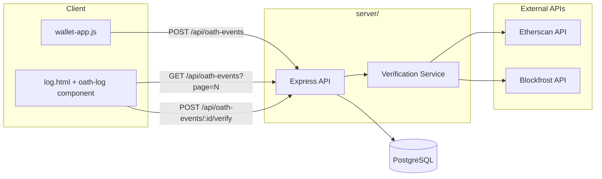

# Oath Event Logging: API, Database, and Client Log Page

## Architecture

## 1. Backend -- `server/` subfolder

Create a new `server/` directory in the repo with a standard Node/Express setup.

**Files to create:**

- `server/package.json` -- Express, pg (node-postgres), cors, dotenv
- `server/index.js` -- Express app entry point, CORS config, route mounting
- `server/db.js` -- pg Pool from `DATABASE_URL`
- `server/routes/oath-events.js` -- route handlers for the three endpoints
- `server/services/verify-tx.js` -- on-chain verification logic
- `server/db/migrate.js` -- simple script to create the table on first run

**Database table `oath_events`:**

| Column | Type | Notes |

|---|---|---|

| id | SERIAL PRIMARY KEY | |

| signer_name | TEXT NOT NULL | |

| chain | TEXT NOT NULL | `'ethereum'` or `'cardano'` |

| tx_hash | TEXT NOT NULL | |

| wallet_address | TEXT | |

| network_mode | TEXT NOT NULL | `'mainnet'` or `'devnet'` |

| explorer_url | TEXT | |

| verified_on_chain | BOOLEAN DEFAULT FALSE | |

| created_at | TIMESTAMPTZ DEFAULT NOW() | |

**API Endpoints:**

| Method | Path | Description |

|---|---|---|

| POST | `/api/oath-events` | Create a new oath event. Body: `{ signer_name, chain, tx_hash, wallet_address, network_mode, explorer_url }`. Attempts on-chain verification; saves regardless of result. Returns the created row. |

| GET | `/api/oath-events` | Paginated list, newest first. Query params: `page` (default 1), `limit` (default 20). Returns `{ data, page, limit, total }`. |

| POST | `/api/oath-events/:id/verify` | Retry on-chain verification for an unverified event. Returns updated row. |

**Verification service (`server/services/verify-tx.js`):**

- Ethereum: call Etherscan API (`eth_getTransactionReceipt` via `module=proxy`) to check if the tx hash exists. Supports both mainnet and Sepolia via different base URLs.
- Cardano: call Blockfrost API (`GET /txs/{hash}`) to check if the tx hash exists. Supports both mainnet and preview.
- Environment variables needed: `ETHERSCAN_API_KEY`, `BLOCKFROST_PROJECT_ID` (mainnet), `BLOCKFROST_PREVIEW_PROJECT_ID` (devnet).
- If the external API call fails (rate limit, network error), the event remains unverified rather than blocking the save.

**Environment variables** (configured on Render):

- `DATABASE_URL` -- Render PostgreSQL connection string
- `ETHERSCAN_API_KEY`
- `BLOCKFROST_PROJECT_ID`
- `BLOCKFROST_PREVIEW_PROJECT_ID`
- `CORS_ORIGIN` -- the frontend origin (e.g. the Render static site URL or `*` during dev)

A `server/.env.example` will document these.

## 2. Frontend changes

**New file: `log.html`** -- a standalone page that displays the paginated oath event log. Includes navigation back to `index.html`.

**New component: `js/components/oath-log.js`** -- Web Component `<oath-log>` that:

- Fetches `GET /api/oath-events?page=1` on load.
- Renders a table/card list of events: signer name, chain, short tx hash (linked to explorer), verified status, date.
- Verified events show a green checkmark; unverified events show a yellow/red warning indicator with a "Verify" button.
- Clicking "Verify" calls `POST /api/oath-events/:id/verify`, then refreshes that row.
- Pagination controls (Previous / Next) at the bottom.

**Modified: [`js/components/wallet-app.js`](js/components/wallet-app.js)**

- In `signCommitment()`, after a successful sign, POST the event to the API (fire-and-forget -- do not block the ceremony if the API is down).
- Add a link/button in the UI header to navigate to `log.html` (the oath log).

**New: `js/lib/api.js`** -- small helper module exporting the API base URL (read from a config or defaulting to the Render URL) and fetch wrappers for the three endpoints.

## 3. Render deployment

Create a `render.yaml` (Infrastructure as Code / Blueprint) at the repo root that declares:

- A **Web Service** for `server/` (Node, start command `node index.js`, env vars referenced).
- A **PostgreSQL** database instance.
- A **Static Site** for the frontend (`index.html`, `log.html`, etc.) pointing to the repo root with publish directory `.` (excluding `server/`).

This allows one-click deploy from the Render dashboard.