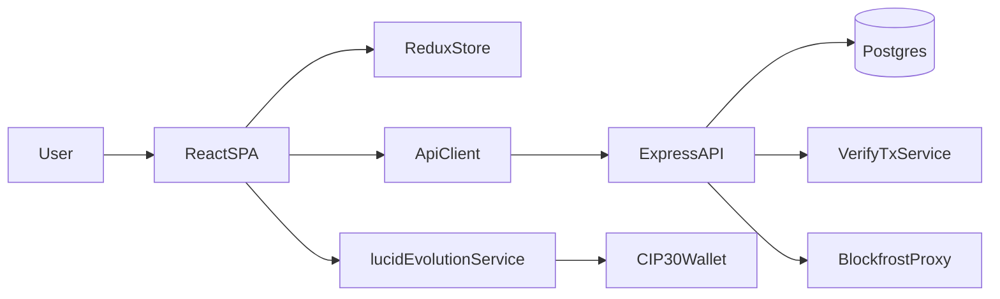

# Migrate Sons of Man to ctools-style React

## Goal and Constraints
- Target: single React SPA with routing, following the `temp/ctools` architecture closely.
- Preserve full parity for current root flows except explicitly remove agnostic commit flow (`commit.html` + `agnostic-commit-app`).
- Reuse and extract everything needed from `temp/ctools` into the main app, then remove `temp/` entirely.

## Source and Target Mapping
- Current app (to migrate from):
  - Frontend entry pages: [`/home/william/projects/sons-of-man/index.html`](/home/william/projects/sons-of-man/index.html), [`/home/william/projects/sons-of-man/ceremony.html`](/home/william/projects/sons-of-man/ceremony.html), [`/home/william/projects/sons-of-man/log.html`](/home/william/projects/sons-of-man/log.html), [`/home/william/projects/sons-of-man/commit.html`](/home/william/projects/sons-of-man/commit.html)
  - Web components and libs: [`/home/william/projects/sons-of-man/js/components`](/home/william/projects/sons-of-man/js/components), [`/home/william/projects/sons-of-man/js/lib`](/home/william/projects/sons-of-man/js/lib)
- Reference architecture (to emulate):
  - React bootstrap/store/router: [`/home/william/projects/sons-of-man/temp/ctools/src/index.tsx`](/home/william/projects/sons-of-man/temp/ctools/src/index.tsx), [`/home/william/projects/sons-of-man/temp/ctools/src/store`](/home/william/projects/sons-of-man/temp/ctools/src/store)
  - Lucid-evolution integration patterns: [`/home/william/projects/sons-of-man/temp/ctools/src/functions/index.tsx`](/home/william/projects/sons-of-man/temp/ctools/src/functions/index.tsx), [`/home/william/projects/sons-of-man/temp/ctools/src/components/ConnectWallet.tsx`](/home/william/projects/sons-of-man/temp/ctools/src/components/ConnectWallet.tsx)

## Migration Phases
1. **Create React app skeleton in repo root (ctools-aligned)**
   - Initialize a TypeScript React app structure with routing + Redux layout matching ctools conventions (`src/pages`, `src/components`, `src/store`, `src/functions`, `src/utils`).
   - Wire SPA routes for `/`, `/ceremony`, `/log`; intentionally omit `/commit` from new navigation.
   - Preserve existing backend/API URL contract from [`/home/william/projects/sons-of-man/js/lib/api.js`](/home/william/projects/sons-of-man/js/lib/api.js).

2. **Extract and standardize blockchain layer to lucid-evolution**
   - Port and adapt lucid-evolution setup/sign/submit helpers from ctools into main app service modules.
   - Replace current dynamic CDN `lucid-cardano` path from [`/home/william/projects/sons-of-man/js/lib/lucid.js`](/home/william/projects/sons-of-man/js/lib/lucid.js) with bundled lucid-evolution imports.
   - Keep server-side Blockfrost proxy behavior via [`/home/william/projects/sons-of-man/server/routes/blockfrost-proxy.js`](/home/william/projects/sons-of-man/server/routes/blockfrost-proxy.js).

3. **Migrate feature flows with parity**
   - **Landing + ticker**: move behavior from [`/home/william/projects/sons-of-man/js/components/landing-page.js`](/home/william/projects/sons-of-man/js/components/landing-page.js) and [`/home/william/projects/sons-of-man/js/components/oath-ticker.js`](/home/william/projects/sons-of-man/js/components/oath-ticker.js).
   - **Ceremony flow**: reimplement step flow from [`/home/william/projects/sons-of-man/js/components/wallet-app.js`](/home/william/projects/sons-of-man/js/components/wallet-app.js) + signer logic from [`/home/william/projects/sons-of-man/js/components/oath-signer.js`](/home/william/projects/sons-of-man/js/components/oath-signer.js).
   - **Oath log**: migrate pagination/reverify UI from [`/home/william/projects/sons-of-man/js/components/oath-log.js`](/home/william/projects/sons-of-man/js/components/oath-log.js).
   - **Do not migrate agnostic commit**: remove corresponding route/page from final app.

4. **Replace global singleton state with store-based state**
   - Migrate `walletState` event-based model from [`/home/william/projects/sons-of-man/js/lib/wallet-state.js`](/home/william/projects/sons-of-man/js/lib/wallet-state.js) into Redux slices patterned after ctools store.
   - Centralize wallet/network/session state and remove `window` event coupling.

5. **Cutover and cleanup**
   - Update local/dev/deploy entrypoints (including [`/home/william/projects/sons-of-man/run_local.sh`](/home/william/projects/sons-of-man/run_local.sh) and [`/home/william/projects/sons-of-man/render.yaml`](/home/william/projects/sons-of-man/render.yaml)) to serve SPA artifacts and API together.
   - Remove obsolete legacy frontend files/pages (`commit.html`, legacy web-component JS/CSS that are no longer used).
   - Delete [`/home/william/projects/sons-of-man/temp`](/home/william/projects/sons-of-man/temp) after parity verification.

## Validation Gates
- Functional parity checklist (excluding agnostic commit):
  - Landing loads oath + ticker data.
  - Ceremony runs full connect -> sign/send -> success flow.
  - Oath event creation and log listing/reverify still work end-to-end against existing backend routes.
- Blockchain regression checks:
  - Cardano tx submission still succeeds with lucid-evolution flow.
  - Backend verification status updates remain compatible with current DB schema and verifier services.
- Deployment checks:
  - Render static + API services continue working with SPA routing behavior.

## Architecture Sketch

## Cleanup Policy
- Keep `temp/ctools` only as a migration reference during implementation.
- Promote required modules/patterns into the primary app namespace immediately.
- Remove all `temp/` artifacts only after parity gates pass.