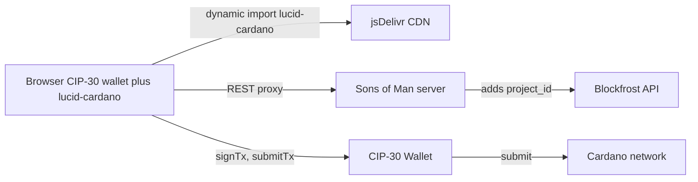

# Switch to lucid-cardano

## Why this path

What we tried so far and why each failed:

- `@lucid-evolution/lucid` via **esm.sh**: imports `cardano_message_signing_bg.wasm` as a JS module; Chrome's strict MIME checking rejects it (the response is `application/wasm`).
- `@lucid-evolution/lucid` via **jsDelivr `+esm`**: jsDelivr's bundler choked on `@emurgo/cardano-message-signing-browser` and the bundle file just contains `throw new Error("Failed to bundle using Rollup ...")`. Imports time out on Chrome's silent module evaluator.
- Self-vendored **esbuild bundle**: 9.7 MB output, but `polyfill-node` doesn't fully cover Lucid Evolution's `effect` / `@effect/schema` / `@cardano-sdk/*` runtime — fails with `(void 0) is not a function` during module init.

What works (verified):

- `https://cdn.jsdelivr.net/npm/lucid-cardano@0.10.7/+esm` returns a **150 KB** ESM bundle with **zero static imports**. Lazy-loaded chunks (`cardano_multiplatform_lib.generated.js` ~341 KB, `cardano_message_signing.generated.js`) are also self-contained with WASM inlined as base64. Node-only chunks (`fs`, `node-fetch`, `ws`, `@peculiar/webcrypto`) are gated behind environment checks and never load in browser.
- Same author as Lucid Evolution. Same conceptual API. Uses CML under the hood (the cardano-multiplatform-library you suggested) — we get its multi-asset / coin-selection / fee-estimation goodness without writing it ourselves.

## Why not direct `@dcspark/cardano-multiplatform-lib-browser`

That is the WASM lib that lucid-cardano wraps. Calling it directly means we write our own coin selection, change calculation, fee estimation, multi-asset accounting, and witness assembly — exactly the "rolling our own" that originally broke (multi-asset wallets) and that we want to escape.

## Architecture



## Concrete changes

### Replace [js/lib/lucid-evolution.js](js/lib/lucid-evolution.js)

Trim it to just three small functions: a single dynamic import, network mapping, and the existing Blockfrost proxy URL helper. Drop the timeout + multi-URL fallback machinery (no longer needed). Suggest renaming to `js/lib/lucid.js` for honesty:

```js
import { API_BASE_URL } from "./api.js";

const LUCID_URL = "https://cdn.jsdelivr.net/npm/lucid-cardano@0.10.7/+esm";

let lucidPromise = null;

export function loadLucid() {
  if (!lucidPromise) {
    lucidPromise = import(LUCID_URL).catch((error) => {
      lucidPromise = null;
      throw error;
    });
  }
  return lucidPromise;
}

export function getLucidNetwork(mode) {
  return mode === "devnet" ? "Preview" : "Mainnet";
}

export function getBlockfrostProxyUrl(mode) {
  const network = mode === "devnet" ? "preview" : "mainnet";
  return `${API_BASE_URL}/blockfrost/${network}`;
}
```

### Update [js/lib/cardano-tx.js](js/lib/cardano-tx.js)

Three small API differences vs lucid-evolution. The `step(...)` diagnostic wrapper stays.

- `Lucid(provider, network)` -> `Lucid.new(provider, network)`
- `lucid.selectWallet.fromAPI(api)` -> `lucid.selectWallet(api)`
- `tx.sign.withWallet().complete()` -> `tx.sign().complete()`
- One module import (`Lucid` and `Blockfrost` come from the same module).

### Update [js/components/cardano-wallet.js](js/components/cardano-wallet.js)

Change the preload import to:

```js
import { loadLucid } from "../lib/lucid.js";
// ...
loadLucid().catch((error) => {
  console.warn("[cardano-wallet] Failed to preload lucid-cardano:", error);
});
```

(Remove the now-gone `loadLucidProvider`.)

### Delete the failed vendoring infra

- `js/vendor/lucid-evolution.bundle.mjs` (9.7 MB)
- `js/vendor/` directory (becomes empty)
- `tools/build-lucid-bundle/` (entire directory, including its `node_modules`)

### Server stays as-is

[server/routes/blockfrost-proxy.js](server/routes/blockfrost-proxy.js) is unchanged. lucid-cardano's `Blockfrost` provider has the same constructor signature `new Blockfrost(url, projectId)` and we already pass `""` for the project id (the proxy injects it server-side).

### Refresh the plan doc

Update [.cursor/plans/lucid_cardano_tx_builder_24a2c0c3.plan.md](.cursor/plans/lucid_cardano_tx_builder_24a2c0c3.plan.md) overview to mention we settled on `lucid-cardano` after `lucid-evolution`'s CDN/bundling problems.

## Risks and mitigations

- **jsDelivr availability**: third-party CDN runtime dep. If it ever causes problems we can vendor the 150 KB main bundle and ~500 KB CML/CMS chunks under `js/vendor/` and serve from our static site (lucid-cardano's relative `import("/npm/...")` paths would need to resolve against jsDelivr though, so vendoring requires committing the chunks too — out of scope for this plan).
- **lucid-cardano is in maintenance mode** (lucid-evolution is the active fork). Acceptable for our small, stable surface (tx with metadata + sign + submit). Pinned at `0.10.7`.

## Verification

1. Reload `commit.html?devnet`, navigate to step 3, watch console for `[lucid-loader] Loaded ...` quickly.
2. With a real Cardano wallet on Preview, complete a CIP-20 commit end-to-end and confirm cardanoscan link.
3. Verify a multi-asset wallet that previously failed now succeeds.